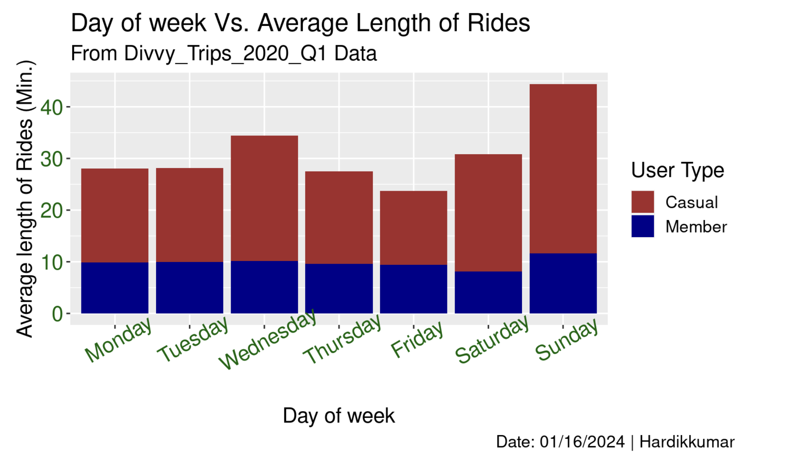

# **Cyclistic Bike-Share : How does a company navigate speedy success?**
## _Author : Hardikkumar Malaviya_
## _Date : 01-17-2024_
---
## Table of Contents:
   - [Project Overview](#Project-Overview)
   - [Data Sources](#Data-Sources)
   - [Hypothesis and Clear goal](#Hypothesis-and-Clear-goal)
   - [Problem & Analysis Task](#Problem-&-Analysis-Task)
   - [Key Findings](#Key-Findings)
   - [Recommendations](#Recommendations)
   - [Things to Consider](#Things-to-Consider)
   
---
Hi everyone, over the last few months, I've been working on the **"Google Data Analytics Professional Certificate"** through Coursera. This is my final capstone project in the course. In this case study, I will be analyzing a public dataset for a fictional bike sharing company provided by the course. I will be using the Google sheets and R programming language for data analysis and visualizations.

---

---
[Case study: How does a bike-share navigate speedy success?](Case Study- Bike Share.pdf)
---
### Project Overview: 

About the company :

* Cyclistic launched a successful bike-share offering in 2016. Since then, the program has grown to a fleet of 5,824 bicycles that are geotracked and locked into a network of 692 stations across Chicago. The bikes can be unlocked from one station and returned to any other station in the system anytime.

* Customers who purchase single-ride or full-day passes are referred to as casual riders. Customers who purchase annual memberships are Cyclistic members. 

### Data Sources:
The primary dataset used for this analysis is the "Divvy_Trips_2020_Q1" file, containing detailed information about each bike trip. [Download](https://divvy-tripdata.s3.amazonaws.com/index.html)

### Hypothesis and Clear goal: 

* Hypothesis : Maximizing the number of annual members will be key to future growth.

 * Goal is to design marketing strategies aimed at converting casual riders into annual members. because cyclistic’s annual members are much more profitable than casual riders.


### Problem & Analysis Task: 


* Problem: Design effective marketing strategies that convert casual customers to annual members 

* Task: How casual riders and annual members use Cyclistic bikes differently?


### Key Findings
* Data: 1st quarter of 2020 and only for Docked-bike.  
* Members uses the bike more compared to the casual customer.
* Also, Members prefer bike on weekdays (Monday to Friday) where the casual customers  on weekends (Saturday and Sunday).

		

* Casual customer spent lot longer time per ride than the annual members.

* Average length of rides for members are almost same for all days.
* On sunday, Casual customer prefer long trip compare to others days of week. 


### Recommendations:

* Introducing plans and promotion on social media that may be more appealing to casual customers for the spring months. Plans could be include rewards system, gift card or great deal for newcomers.

* By offering good membership rates in coldest months of the year(1st quarter ). Initially targeting casual customer who only use services on the weekends specifically. payment structure may be altered in order to make single-use more costly to the casual customers and lowering the annual membership rate.

* Offering membership that can hold lifelong rewards point and history to casual riders who don’t use service very often. Also provide membership option that allows borrow maximum three  bikes at a time on single membership called family plan. Family plan option would offer special discount. 

### Things to Consider:


* The report understands the scope of this analysis is extremely limited and because of that fact, additional data, as well as data points may have been able to contribute to this report offering an even more granular analysis. The following are data points that could have enhanced the report (Additional points that were not examined):
Types of bike: Company offering different types of bikes, but this analysis data include only docked type of bike. From these data, can identify which type of bike customers prefer the most.

* Additional data : Whole year data, that would create big picture of uses of bikes in all weather condition throughout the year. The records used for this analysis include only 1st quarter of year data, which is the most coldest and windy weather in chicago.

* Pricing structure: It would  be effective to understanding the spending behaviour of casual user and membres based on the different bike sharing plans. 

### Thank You!


### Install Packages : 

```{r Install Packages, warning=FALSE}
install.packages("tidyverse")
install.packages("lubridate")
install.packages("janitor")
install.packages("dplyr")
install.packages("ggplot2")
```


### Load Packages:
```{r Load Packages}
library(tidyverse)
library(lubridate)
library(janitor)
library(dplyr)
library(tidyr)
library(scales)
library(ggplot2)
library(ggpubr)
rm(list=ls())
```

### Check is there any empty rows or colums

```{r Check empty rows and Cols}
Bike_D1 <- read_csv("Divvy_Trips_2020_Q1.csv") %>% 
remove_empty(which = c("cols")) %>% 
remove_empty(which = c("rows")) 
```


### Add columns with day of week and start / end time in hours and minutes
```{r add column with day of week and start/ end time}
Bike_Data <- Bike_D1 %>% 
  mutate(day_of_week=weekdays(started_at)) %>% 
  mutate(start_hr=format(as.POSIXct(started_at), format = "%H:%M")) %>% 
  mutate(end_hr=format(as.POSIXct(ended_at), format = "%H:%M")) 
```


### Start time :
```{r Start time}
df1<-separate(Bike_Data,col=start_hr, into = c('start_h', 'start_m'), sep = ':',remove = TRUE, convert = FALSE) %>% 
    mutate(Start_Time_minutes = (as.integer(start_h) * 60 + as.integer(start_m)))
    
```

### End Time : 
```{r End Time}
df2<- 
  separate(Bike_Data,col=end_hr, into = c('end_h', 'end_m'), sep = ':',remove = TRUE,
  convert = FALSE) %>% 
    mutate(End_Time_minutes = (as.integer(end_h) * 60 + as.integer(end_m)))
```

### Merge data frams :
```{r Merge data frams }
df3<-merge(x = df1, y = df2, all = TRUE)
```

### Calculte ride length = end time - start time
```{r Calculate ride length}
Final_Data <- df3 %>% 
  mutate(ride_length = End_Time_minutes- Start_Time_minutes)
```

### Plot 1:

```{r Plot2 : Member and Casual Riders Vs. Average Length of Rides }
Final_Data %>% 
  group_by(member_casual) %>% 
  arrange(member_casual,desc(member_casual)) %>% 
  summarise(mean_ride=mean(ride_length)) %>% 
 ggplot() + geom_col(aes(y=mean_ride, x= member_casual), fill= "darkblue") +
  labs(title = "Member and Casual Riders Vs. Average Length of Rides",subtitle = "From Divvy_Trips_2020_Q1 Data", caption = "Date: 01/16/2024 | Hardikkumar",
                x="Membership", y="Average length of Rides (Min.)") +
  theme(axis.text.x = element_text(size= 15 ,angle = 0, color= "darkgreen"),axis.text.y = element_text(size = 15, color = "darkgreen"),text = element_text(size = 15)) 
```


### Plot 2:

```{r Plot3 : day of week Vs. Average Length of Rides with type of Membership }
Final_Data$day_of_week <- factor(Final_Data$day_of_week, c("Monday", "Tuesday", "Wednesday","Thursday","Friday","Saturday", "Sunday"))
Final_Data %>%
          group_by(day_of_week,member_casual) %>% 
          summarise(mean_ride=mean(ride_length)) %>% 
      ggplot() + geom_col(aes(y=mean_ride, x= day_of_week, fill= member_casual) )+
      labs(title = "Day of week Vs. Average Length of Rides",subtitle = "From Divvy_Trips_2020_Q1 Data", caption = "Date: 01/16/2024 | Hardikkumar",
                x="Day of week", y="Average length of Rides (Min.)") +
                theme(axis.text.x = element_text(size= 15 ,angle = 30, color= "darkgreen"),
                      axis.text.y = element_text(size = 15, color = "darkgreen"),
                      text = element_text(size = 15),plot.caption.position = "plot") +
      scale_fill_manual(name="User Type",labels=c("Casual", "Member"), values=c("brown", "darkblue"))
```



### Plot 3:

```{r Plot 4:Day of Week Vs. Average Length of Rides with type of Membership }
Final_Data$day_of_week <-
           factor(Final_Data$day_of_week, c("Monday", "Tuesday", "Wednesday","Thursday","Friday","Saturday", "Sunday"))

Final_Data %>% ggplot() + geom_bar(aes(x=day_of_week, fill= member_casual), position = "dodge")+
   
labs(title = "Day of Week Vs. Total Number of Rides",subtitle = "From Divvy_Trips_2020_Q1 Data",
             caption = "Date: 01/16/2024 | Hardikkumar",
           x="Day of week", y="Total Number of Rides")+
           theme(axis.text.x = element_text(size= 12 ,angle = 30, color= "darkgreen"),
                 axis.text.y = element_text(size = 12, color = "darkgreen"),
                 text = element_text(size = 15),plot.caption.position = "plot") +
           scale_y_continuous(labels = unit_format(unit = "K", scale = 1e-3))+
           scale_y_continuous(labels = unit_format(unit = "K", scale = 1e-3),
                        breaks = c(0, 10000, 20000, 30000, 40000, 50000,60000,70000,80000))+
           scale_fill_manual(name="User Type",labels=c("Casual", "Member"), values=c("brown", "darkblue"))
```


